<h1 align="center">🎓 Mentor–Student Platform</h1>

\## 📘 About the Project

The Student-Mentor Project is a real-time collaborative platform designed to connect students with mentors for effective learning and guidance. It enables seamless communication through integrated chat, video calling, and live code editing features, allowing users to interact instantly without delays. The platform focuses on enhancing learning efficiency by providing interactive tools where students can ask questions, clarify doubts, and share ideas in real time. Mentors can guide students more effectively through live discussions and collaborative coding sessions, making the learning process practical and engaging. The system supports multiple users in a single session and ensures smooth performance with minimal latency. It is built with a user-friendly interface that allows easy navigation and accessibility for all users. Additionally, the platform maintains session continuity, ensuring that chat messages and code are preserved throughout the session. By integrating multiple functionalities into one system, it eliminates the need for separate tools for communication and coding. The project is developed using modern web technologies to ensure scalability, reliability, and responsiveness. It provides a structured environment for personalized mentoring, coding practice, and interview preparation. Overall, the system acts as a virtual classroom that enhances collaboration, improves communication, and delivers an efficient and engaging learning experience.

\## 🎯 AIM

The main aim of this project is to create an interactive and real-time learning environment that enhances communication between students and mentors. It focuses on bridging the gap between learners and educators through the effective use of modern technology. The platform is designed to provide instant communication using chat and video calling features, enabling quick and efficient interaction. Another key objective is to support collaborative coding sessions, allowing students to learn through practical, hands-on experience. The system ensures a smooth and responsive user experience with minimal latency during live sessions. It is built to handle multiple users simultaneously without affecting performance. Providing a clean, distraction-free, and intuitive interface is also an important goal of the project. The platform aims to improve students’ problem-solving skills through real-time guidance and mentorship. It emphasizes continuous interaction to make learning more engaging and effective. The system also focuses on maintaining reliability and data consistency throughout the sessions. It encourages active participation and better understanding through live collaboration. The project supports structured and personalized learning experiences for users. It aims to simplify online education by integrating multiple tools into a single platform. Additionally, it ensures accessibility and ease of use for both students and mentors. Ultimately, the project enhances the overall quality of online education by making it more interactive, efficient, and impactful.

\## 📖 Introduction

In today’s digital world, online learning platforms are becoming increasingly important for education and skill development. However, many existing platforms lack real-time interaction between students and mentors, which reduces learning effectiveness. This project addresses that limitation by providing a live collaborative environment where users can interact instantly. It integrates chat, video calling, and coding tools into a single unified platform. Users can join sessions and communicate in real time without any noticeable delays. The system is designed to be simple, intuitive, and accessible for both beginners and experienced users. It enhances the learning process through direct interaction and immediate feedback from mentors. The platform encourages active participation and engagement during sessions. It also supports session-based communication, allowing structured and organized learning experiences. By combining multiple functionalities into one system, it eliminates the need for switching between different tools. The project focuses on improving productivity and learning efficiency. It provides a practical approach to learning through collaboration and live problem-solving. The platform ensures smooth performance and reliable communication during sessions. It also adapts well to different learning scenarios such as classes, mentoring, and coding practice. Overall, this system makes online learning more interactive, efficient, and engaging for users.

\## 🛠️ Tech Stack

\### Frontend Technologies

The frontend is built using React.js for creating dynamic and reusable UI components.

Next.js is used for server-side rendering and improved performance.

It ensures a fast, responsive, and user-friendly interface.

\### 🔹 Backend Technologies

The backend is developed using Java Spring Boot for handling business logic.

It provides a robust and scalable server-side architecture.

It efficiently manages requests, sessions, and data processing.

\### 🔹 Real-Time Communication

WebSocket is used to enable real-time bidirectional communication.

STOMP protocol helps in structured messaging between client and server.

It ensures instant updates for chat and session activities.

\### 🔹 Video Communication

WebRTC is used to implement real-time video and audio communication.

It supports peer-to-peer connection with low latency.

It enables live interaction between students and mentors.

\### 🔹 Database

PostgreSQL is used for storing application data.

It manages user details, sessions, and communication records.

It ensures data consistency and efficient retrieval.

\### 🔹 API Communication

REST APIs are used for communication between frontend and backend.

They handle data exchange and service requests efficiently.

They ensure a structured and secure data flow.

\### 🔹 Styling \& UI

Tailwind CSS is used for designing responsive and modern interfaces.

It provides utility-based styling for faster development.

It ensures consistency and clean UI design across the platform.

\### 🔹 Performance \& Scalability

The system is designed to handle multiple users simultaneously.

Efficient architecture ensures minimal latency and high performance.

It supports future scaling with increasing user demand.

The Student-Mentor Project is built using modern technologies to ensure high performance, scalability, and responsiveness. The frontend is developed using React.js, which enables dynamic and component-based user interface development, making the application interactive and efficient. Next.js is used to enhance performance through server-side rendering and optimized routing, ensuring faster page loads. Tailwind CSS is implemented for styling, providing a clean, responsive, and customizable design across different devices. The backend is built using Java Spring Boot, which efficiently handles business logic and server-side operations. Spring Boot ensures a robust and scalable architecture capable of managing multiple user requests simultaneously. WebSocket technology is used to enable real-time communication between users, allowing instant data exchange. The STOMP protocol is used over WebSocket for structured message handling in chat and signaling processes. SockJS is integrated to ensure compatibility across different browsers and network conditions, improving reliability. WebRTC is used for implementing peer-to-peer video calling functionality, enabling smooth and low-latency communication. It supports real-time audio and video interaction between participants. PostgreSQL is used as the database for storing structured data such as user information, session details, and communication records. It provides strong data consistency, reliability, and efficient query performance. REST APIs are used to facilitate communication between the frontend and backend systems in a structured manner. The overall architecture is designed to efficiently handle multiple users and sessions without performance issues. This combination of technologies ensures a fast, reliable, and seamless user experience.

\## 💡 Use Cases

Students can join live sessions to learn directly from mentors in real time, making the learning process more interactive and engaging. Mentors can conduct live coding sessions where they explain concepts and solve problems step by step. Users can communicate instantly through the chat feature during sessions for quick doubt clarification. Video calling enables face-to-face interaction, which improves understanding and personal connection. The platform can be effectively used for coding interview preparation and mock interview practice. It is highly useful for clarifying academic doubts across various subjects. Teachers can utilize the system to conduct virtual classrooms and online lectures. The platform supports collaborative problem-solving where multiple users can work together on the same task. It also encourages peer-to-peer learning, allowing students to help each other. The system can be used for project discussions and group learning activities. It is suitable for both one-on-one mentoring and group sessions. Users can practice coding in real time with guidance from mentors. The platform can also be used for skill development and technical training programs. It provides a flexible environment for remote learning without geographical limitations. Overall, it serves multiple educational and mentoring purposes, making learning more effective, interactive, and accessible.

\## 📸 Screenshots with Explanation of Each Functionality

\## Mentor Register Page

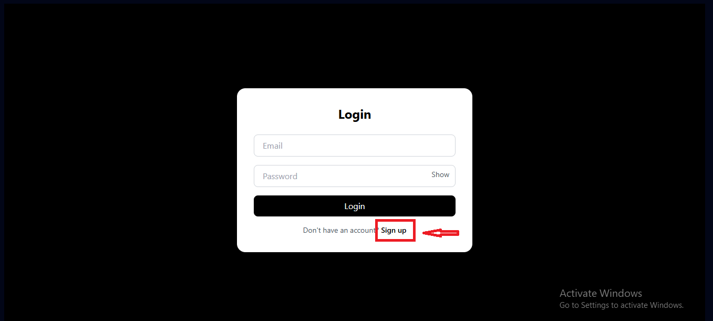

The Signup Page allows new users to create an account by entering basic details.

It provides a simple and secure registration process for both students and mentors.

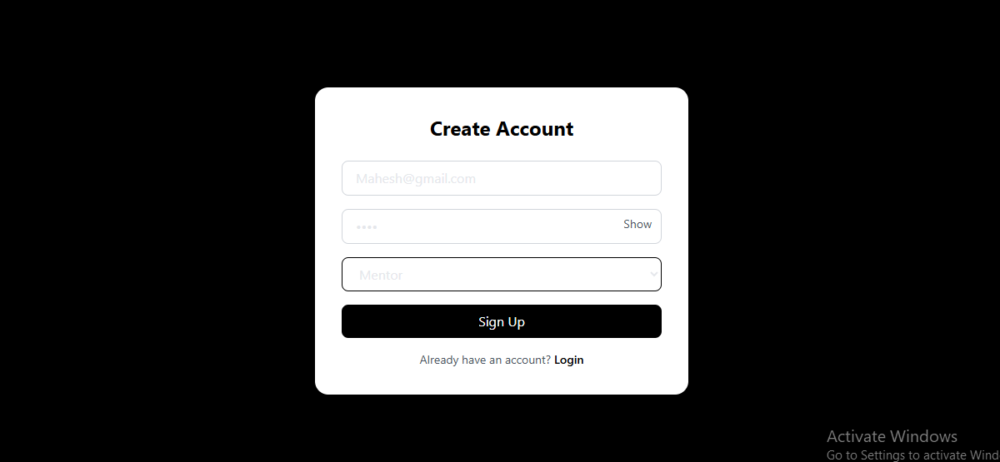

The Mentor Register Page allows mentors to create an account by entering basic details like name, email, and password.

It includes form validation to ensure all required information is entered correctly.

The interface is clean, simple, and user-friendly for easy navigation.

A submit button is provided to complete the registration process securely.

After registration, mentors can log in and start conducting mentoring sessions.

\## Mentor Login Page

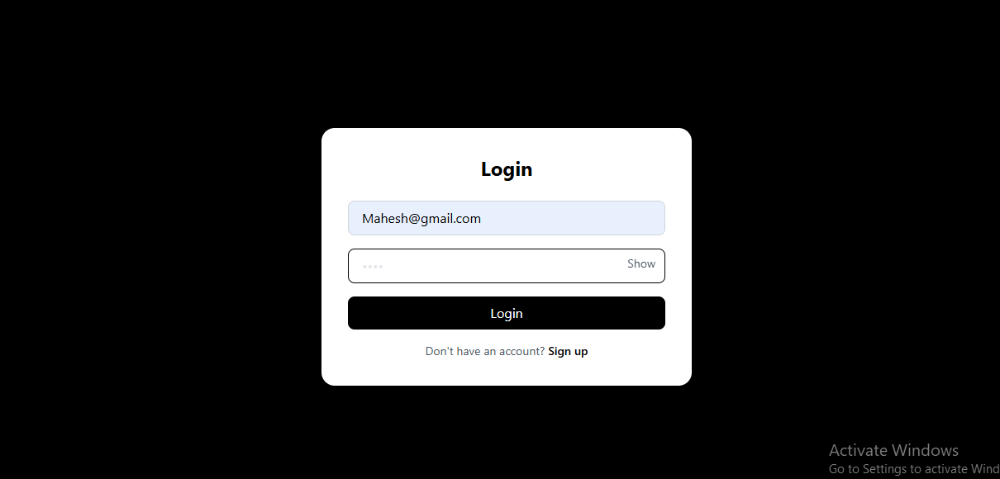

The Mentor Login Page allows mentors to securely access their accounts using email and password.

It includes input validation to ensure correct credentials are entered.

The interface is clean and user-friendly for easy login.

Error messages are shown for invalid login attempts.

After successful login, mentors are redirected to their dashboard.

\## Student Register Page

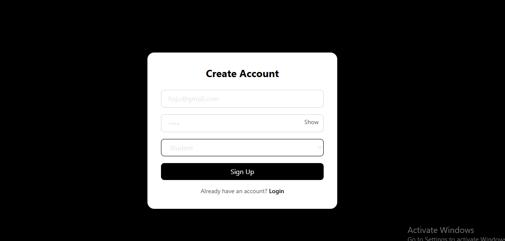

The Student Register Page allows students to create an account by entering details like name, email, and password.

It includes validation to ensure all required fields are filled correctly.

The interface is simple and user-friendly for easy registration.

A submit button is provided to securely complete the signup process.

After registration, students can log in and join mentoring sessions.

\## Student Login Page

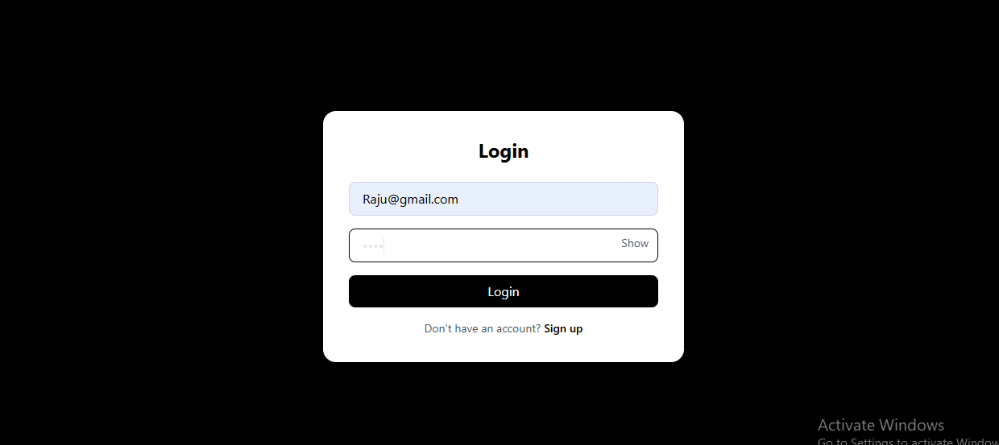

The Student Login Page allows students to access their accounts using their email and password.

It includes validation to ensure the entered credentials are correct.

The interface is simple and user-friendly for easy access.

Error messages are displayed if login details are incorrect.

After successful login, students are redirected to their dashboard.

\### Mentor Dashboard

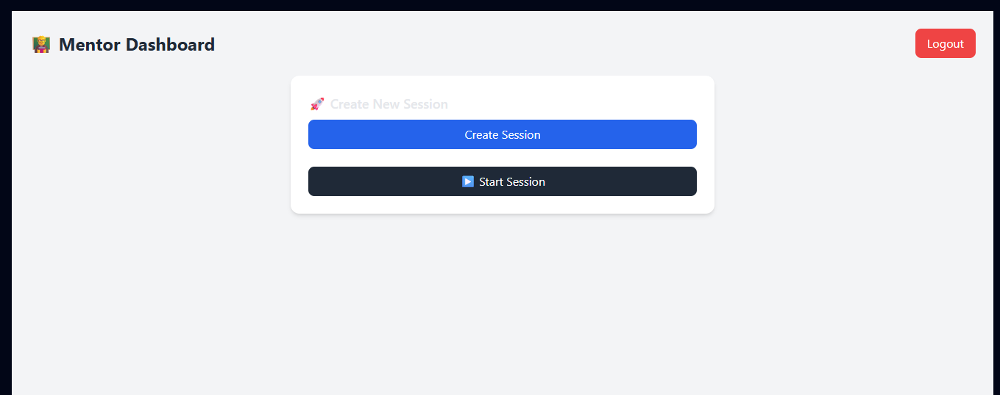

The Mentor Dashboard provides an overview of all mentoring activities and sessions.

It allows mentors to create, manage, and join live sessions

Mentors can view student requests and interact with them in real time.

The dashboard includes access to chat, video call, and code editor features.

It is designed with a clean and intuitive interface for smooth navigation.

\### Student Dashboard

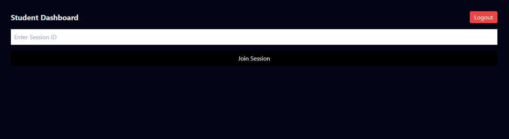

The Student Dashboard provides an overview of available sessions and learning activities.

It allows students to join live mentoring sessions with ease.

Students can access chat, video call, and code editor features from one place.

The interface is simple, clean, and user-friendly for smooth navigation.

It helps students track and participate in their learning effectively.

\## Session Creation

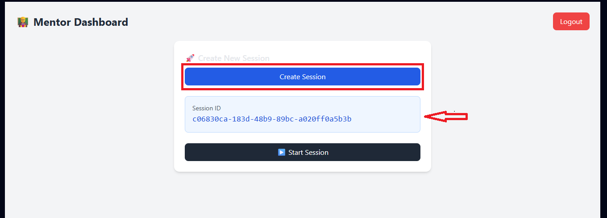

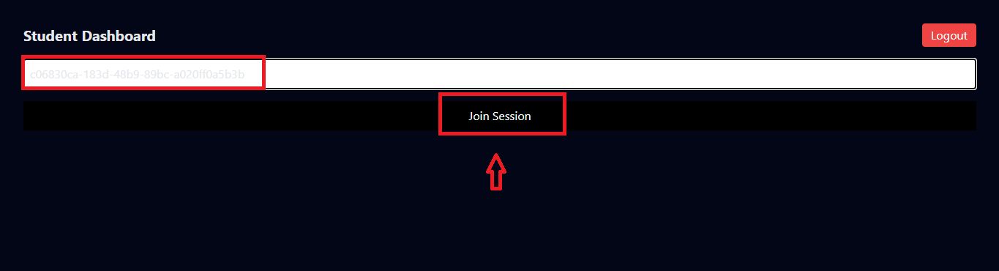

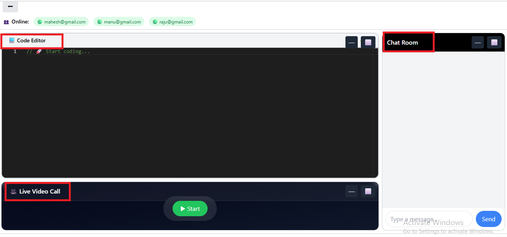

The Session Creation page allows mentors to create new mentoring sessions easily.

Mentors can enter details such as session title, description, and schedule.

It provides options to generate or share a unique session ID or link.

The interface is simple and ensures quick setup of sessions.

Once created, students can join the session using the provided details.

\## Session Room

\## Mentor Session

&#x20;

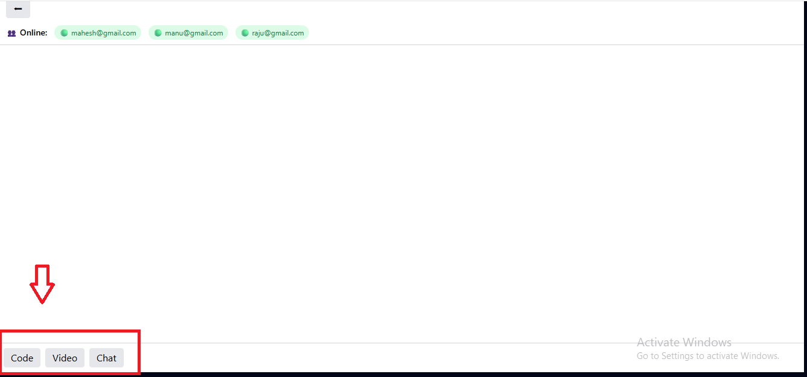

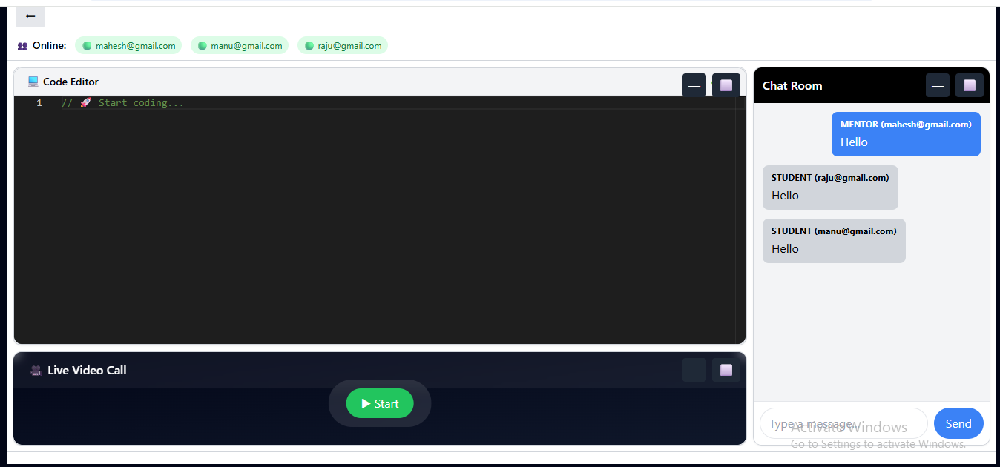

\## Student Session

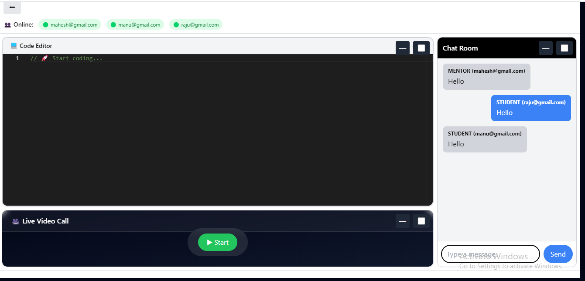

The Session Room is the main workspace where students and mentors interact in real time.

It integrates chat, video calling, and a live code editor in a single interface.

Users can communicate instantly and collaborate during the session.

The layout is designed to support multiple participants smoothly.

It provides an interactive environment for effective learning and mentoring.

\### Online User Visibility 

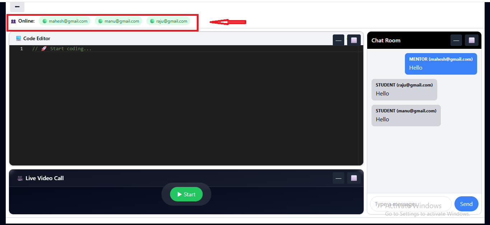

The Online User Visibility feature shows the list of users currently active in the session.

It helps participants know who is available for interaction in real time.

The list updates dynamically as users join or leave the session.

It improves collaboration by making user presence clearly visible.

This feature enhances communication and coordination during mentoring sessions.

\## Chat Room

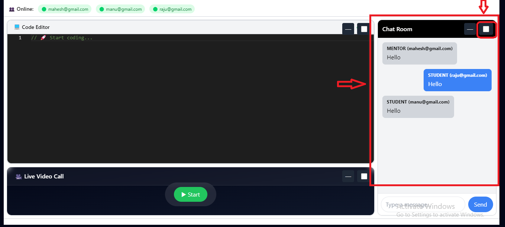

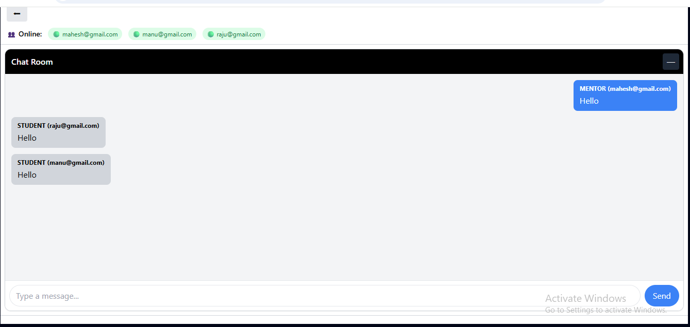

The Chat Room enables real-time communication between students and mentors during sessions.

It allows users to send and receive messages instantly without any page refresh.

The chat system is powered by WebSocket for fast and reliable messaging.

Messages are displayed in a structured format for better readability.

It maintains the conversation history throughout the active session.

Users can continue discussions even while using other features like video call or code editor.

The interface is simple, clean, and easy to use.

It helps in quick doubt clarification and effective interaction.

The chat remains visible even after minimizing and maximizing the window.

Overall, it enhances collaboration and makes communication seamless during mentoring sessions.

.

\## Video Call

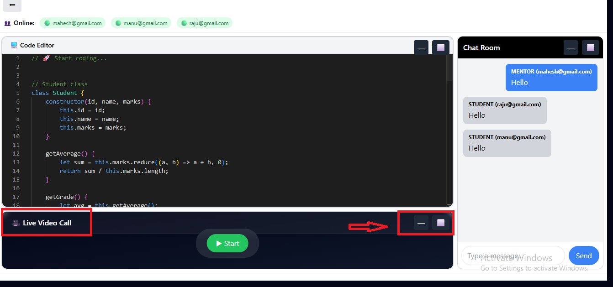

The Video Call feature enables real-time face-to-face communication between students and mentors.

It is implemented using WebRTC for fast and low-latency audio and video transmission.

Users can join the call directly from the session room without any external tools.

It includes controls such as mute/unmute and camera on/off for better interaction.

Multiple participants can join the same video session simultaneously.

The layout adjusts dynamically based on the number of users.

It provides a smooth and stable connection during sessions.

Video calling improves understanding through visual explanation.

It enhances engagement compared to text-based communication alone.

Overall, it creates a more interactive and effective learning environment.

.

\### ▶️ Video Call Start

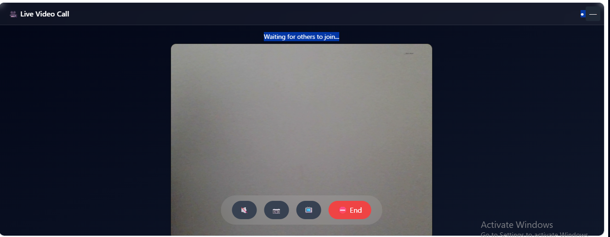

Users can start a video call to begin real-time interaction in a session.

It establishes a connection between participants instantly.

\### ⏹️ Video Call End

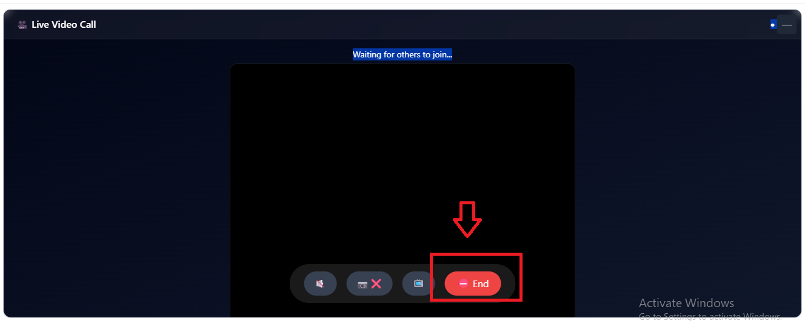

Users can end the video call at any time during the session.

It disconnects all participants and stops audio/video streaming.

\### 🖥️ Screen Share

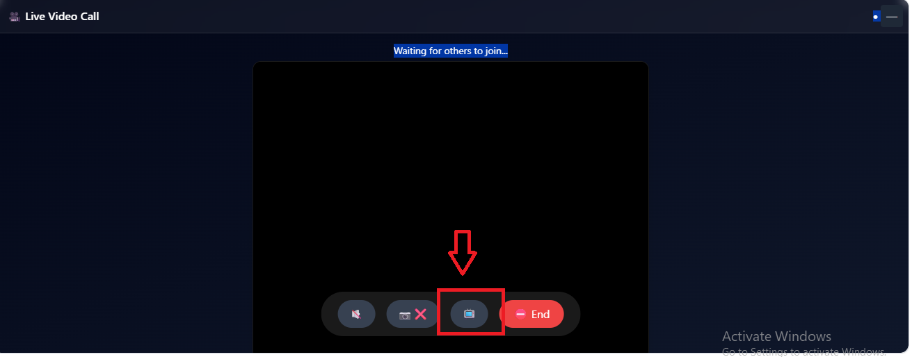

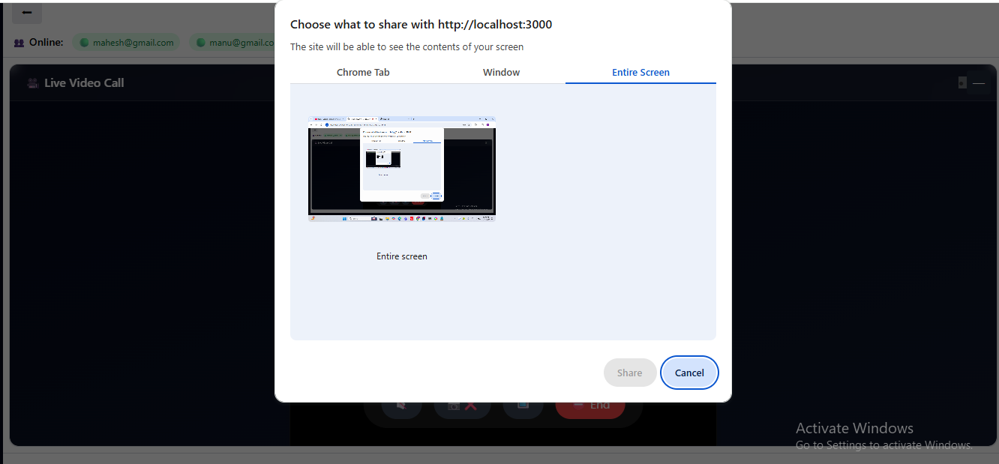

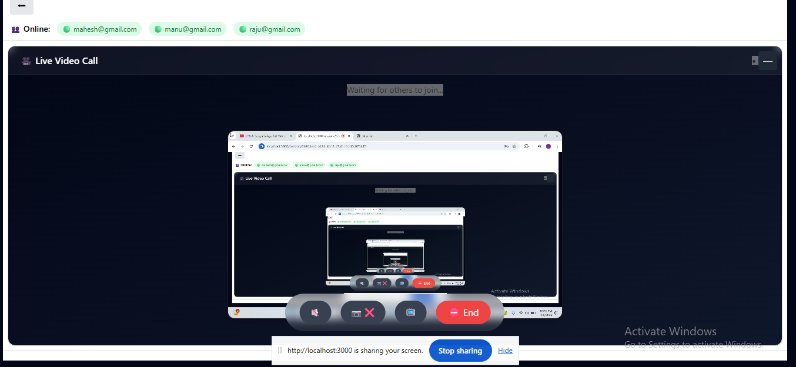

Screen sharing allows users to display their screen to others in the session.

It helps in explaining code, presentations, or concepts visually.

\### 🔇 Mute / Unmute

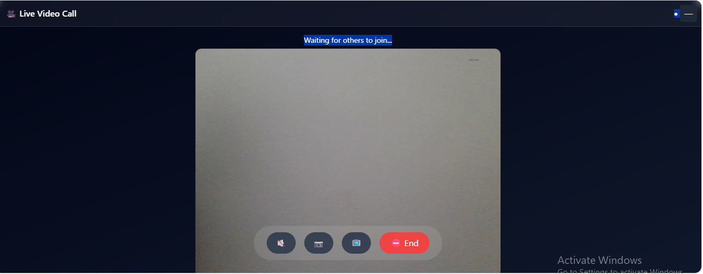

Users can mute or unmute their microphone during the call.

It helps control background noise and manage communication effectively.

\### 📷 Camera On / Off

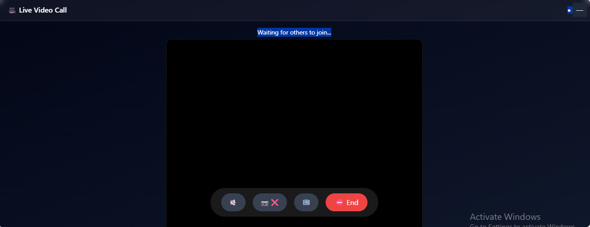

Users can turn their camera on or off as needed.

It provides flexibility and helps manage privacy during sessions.

\## Code Editor

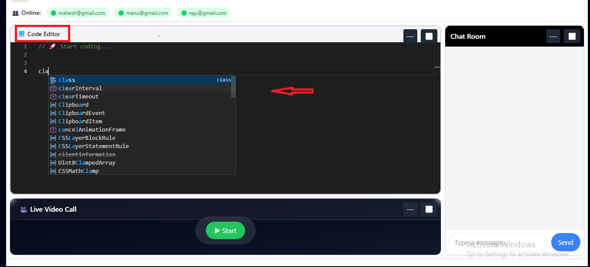

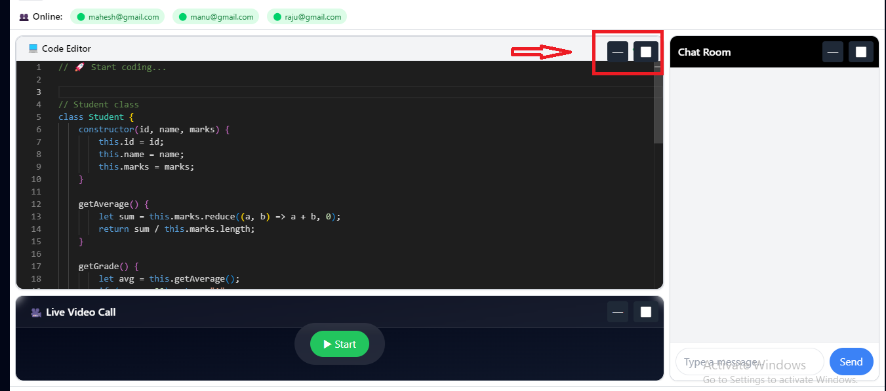

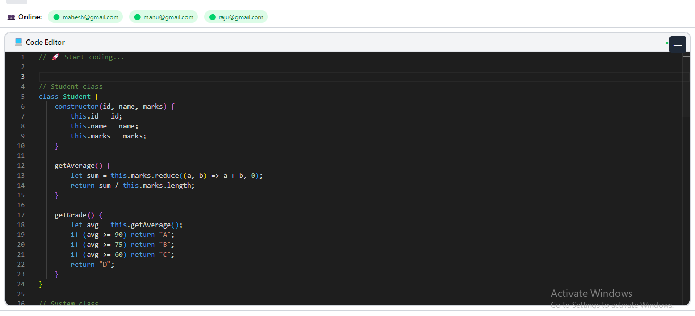

The Code Editor enables real-time collaborative coding between students and mentors.

It allows multiple users to write and edit code simultaneously.

Changes made by one user are instantly reflected for all participants.

The editor supports syntax highlighting for better code readability.

It helps mentors explain concepts through practical coding examples.

Students can practice and debug code during live sessions.

The editor ensures smooth performance with minimal delay.

It maintains code consistency throughout the session.

The interface is responsive and easy to use for all users.

Overall, it enhances hands-on learning and improves coding skills effectively.

\## 🚀 Future Enhancements

The Student-Mentor Project can be further improved by adding several advanced features to enhance usability and scalability. One major enhancement is the integration of AI-based recommendations to suggest mentors, topics, or learning paths based on student performance. The platform can include session recording functionality so users can revisit past sessions for better understanding. Adding a file-sharing feature will allow users to exchange documents, notes, and assignments easily. A notification system (email/SMS/push) can be implemented to alert users about upcoming sessions or messages.

Another improvement is the addition of role-based dashboards with analytics, where mentors can track student progress and students can view their learning history. The system can be enhanced with multi-language support to make it accessible to a wider audience. Implementing screen sharing during video calls would further improve teaching effectiveness. Security can be strengthened by adding authentication methods like OAuth and two-factor authentication.

Scalability can be improved by deploying the application on cloud platforms with load balancing. Mobile application support (Android/iOS) can also be developed for better accessibility. Integration with coding platforms or online judges can help students practice coding problems directly. Lastly, adding a feedback and rating system will help improve mentor quality and overall platform experience.

\## ✅ Conclusion

The Mentor–Student Platform successfully delivers a real-time collaborative learning environment for students and mentors by integrating essential features like chat, video calling, and live code editing into a single unified system. It significantly improves communication and interaction, making the learning process more engaging, interactive, and effective. Students benefit from practical, hands-on learning through real-time collaboration, while mentors can provide instant feedback and personalized guidance. The platform ensures a smooth and user-friendly experience across all functionalities, supported by modern technologies that enhance performance, scalability, and reliability. By combining multiple tools into one platform, it eliminates the limitations of traditional online learning systems. It supports various use cases such as virtual classrooms, coding practice, and mentoring sessions. The system is flexible and adaptable to different learning environments and user needs. Additionally, it has strong potential for future enhancements such as AI-based features and advanced analytics. The platform can scale to support a larger number of users and broader applications. Overall, it stands as a powerful, efficient, and modern solution for digital learning and real-time collaboration.

